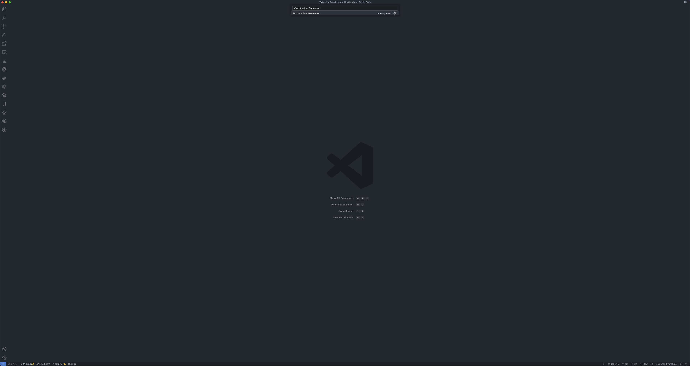
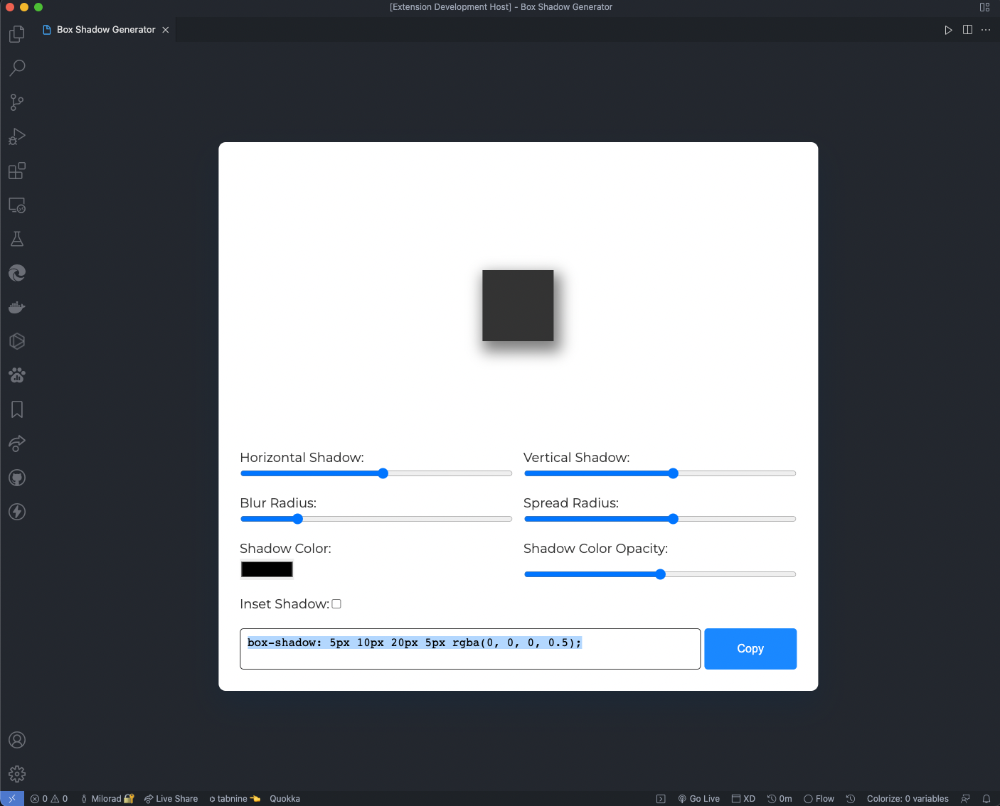

# Box Shadow Generator

Box Shadow Generator is a Visual Studio Code extension that makes it easier to work with the CSS 'box-shadow' property.

## Features

Generate CSS property "box-shadow" values from a simple GUI.

## Screenshots

 

## Usage

1. Open the command palette (Ctrl+Shift+P on Windows and Linux, Cmd+Shift+P on OS X) and search for "Box Shadow
   Generator"

2. Generate the values from the GUI

3. Copy the code below and paste it in your CSS

## Contributing

The source for this extension is available on [GitHub](https://github.com/miloraddjordjevic95/Box-Shadow-Generator.git).
Contributions are extremely welcome! If anyone feels that there is something missing or would like to suggest
improvements please [open a new issue](https://github.com/miloraddjordjevic95/Box-Shadow-Generator/issues) or send a
pull request!

## License

[MIT](https://opensource.org/licenses/MIT)
